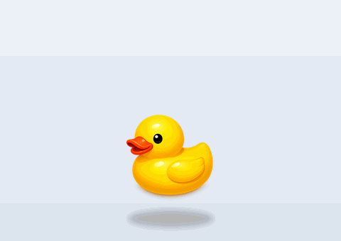

# 🦆 Rubber Duck Debugger

<p align="center"><a href="README.md">한국어</a> | <b>English</b></p>

<p align="center">
  
</p>

<p align="center">
  A rubber-duck-debugging desktop pet. It floats on your desktop and <b>quacks with a speech bubble when you click it</b>.<br>
  Always-on-top like Steam's Bongo Cat, with a <b>fully customizable image / GIF / phrases / sound</b>.
</p>

<p align="center">
  <a href="https://github.com/nohseongmin/rubber-duck-debugger/releases/latest"></a>
  
  <a href="LICENSE"></a>
  <a href="https://github.com/nohseongmin/rubber-duck-debugger/stargazers"></a>
</p>

<p align="center">
  <a href="https://github.com/nohseongmin/rubber-duck-debugger/releases/latest/download/RubberDuckDebugger-Setup.exe"><b>⬇️ Download installer (Windows) — click</b></a><br>
  <sub>Download → run → done. No npm required.</sub>
</p>

> Rubber duck debugging: a classic developer technique — explaining your stuck code line by line to a rubber duck until you spot the bug yourself.

## ✨ Features

- **Lives on your desktop**: transparent, frameless, always-on-top. Only the duck shows — no window box.
- **Click to quack**: left-click the duck for a synthesized "quack" + a random-phrase speech bubble + a squish animation.
- **Idle bob**: the duck gently floats up and down even when idle. (Auto-disabled if your OS prefers reduced motion.)
- **Occasional self-chatter**: the duck sometimes pops a speech bubble on its own. Interval and whether it makes sound are configurable (silent bubble by default).
- **Skin packs (`.rduck`)**: bundle a character (image/GIF/WebP), sound, phrases and bubble colors into one file — **import → switch → delete**. Sample: [`skins/pinky-duck.rduck`](skins/pinky-duck.rduck) → Settings → Skin → "Import".
- **Right-click menu**: right-click the duck → Move / Settings / GitHub / Close.
- **Move mode**: pick "Move" from the menu and a dashed outline appears — grab and drag to reposition, then `Done` or `Esc` (position auto-saved). Clicking (quack) and moving are separate, so nothing feels ambiguous.
- **Global hotkey**: press your configured shortcut (default `Ctrl+Shift+D`) to make the duck quack from anywhere, even while another app is focused.
- **Click-through**: everywhere except the duck is click-through, so your desktop icons stay usable.
- **Fully customizable**: character (built-in duck / emoji / your own image or **GIF** / size), speech phrases, sound (synthesized quack or your own file / volume), and bubble duration — all in the settings window.
- **Tray app**: the tray menu offers Test quack / Settings / Open GitHub / Quit.

> A default character (transparent rubber-duck image) is bundled, and the default "quack" is synthesized in real time with the Web Audio API (no audio file shipped). Swap in your own image / GIF / emoji / sound from Settings. Asset details in [CREDITS.md](CREDITS.md).

## 📥 Install (regular users)

**No npm, no build steps — just grab the installer.**

1. Download **[⬇️ the installer](https://github.com/nohseongmin/rubber-duck-debugger/releases/latest/download/RubberDuckDebugger-Setup.exe)** and run it
2. If Windows SmartScreen shows "unknown publisher / protected your PC" → **More info → Run anyway** (expected, since it isn't code-signed)
3. The duck appears at the bottom-right. **Left-click → quack!** · settings/quit via **right-click** on the duck or the tray icon

> Grab new versions from [Releases](https://github.com/nohseongmin/rubber-duck-debugger/releases). (Auto-update is on the roadmap.)

## 🛠 For developers — run/build from source

```bash
npm install
npm start        # dev run
npm test         # skin-import security tests
npm run dist     # build installers → dist/ (Windows nsis / macOS dmg / Linux AppImage)
npm run gen-icons  # regenerate placeholder icons (optional)
```

## 🎨 Making a skin pack (`.rduck`)

Zip a `skin.json` plus assets and rename it to `.rduck`. That's it. (Settings → Skin → Import)

```
my-skin.rduck (zip)
├─ skin.json
├─ char.webp     # image / GIF / APNG / WebP — animation supported
└─ quack.mp3     # optional (falls back to the synthesized quack)
```

```json
{
  "formatVersion": 1,
  "id": "my-skin",
  "name": "My Skin",
  "author": "nickname",
  "version": "1.0.0",
  "character": { "image": "char.webp", "size": 130 },
  "sound":     { "file": "quack.mp3", "volume": 0.6 },
  "phrases":   ["Quack!", "Read that line again"],
  "bubble":    { "textColor": "#5a1040", "bgColor": "#ffe3f1" }
}
```

> **Security**: skins are **pure assets** — no code execution. On import we reject path traversal (zip slip), oversized/zip-bomb payloads and forged manifests, and extract only allowlisted image/audio files. ([tests](test/skins.test.js) · [design](docs/DESIGN-v0.3.md))
>
> Roadmap: v1.0 will let you publish and subscribe to skins via the **Steam Workshop**.

## 🧩 Tech stack

- **Electron** — main process (Node) + renderer (HTML/CSS/JS)
- **Web Audio API** — dependency-free real-time "quack" synthesis
- **Self-contained JSON settings** — `userData/config.json` (no external store)
- **Pure-Node PNG generator** — `scripts/gen-icons.js` (no binary assets committed)
- **electron-builder** — cross-platform packaging

## 📁 Project structure

```
rubber-duck-debugger/
├─ src/
│  ├─ main.js          # Electron main: windows, tray, IPC, settings
│  ├─ preload.js       # whitelisted IPC bridge (contextIsolation)
│  ├─ config.js        # settings defaults + JSON load/save
│  ├─ duck/            # duck widget (transparent window): index.html, duck.css, duck.js
│  └─ settings/        # settings window: index.html, settings.css, settings.js
├─ scripts/
│  └─ gen-icons.js     # icon PNG generator
├─ assets/             # duck image, icons, demo gif
└─ package.json
```

## 🔐 Security

- Renderer runs with `contextIsolation: true`, `nodeIntegration: false` — only the whitelisted preload IPC is exposed.
- CSP blocks remote scripts (`script-src 'self'`); only local files are loaded.
- **No** network calls, logins, or data collection. All settings stay local.

## 🗺️ Roadmap

- **v0.2** — ✅ idle bob · ✅ occasional self-chatter · (planned) talking sprite
- **v0.3** — skin packs (`.rduck`) import/apply/manage, multiple ducks, assignable action hotkeys ([design](docs/DESIGN-v0.3.md))
- **v1.0** — **Steam release + Workshop (UGC) support**, auto-update, code signing

## 📄 License

Code is MIT. The default "quack" is synthesized in code and the character image is a project-owned asset, so there are currently no bundled third-party assets requiring attribution. Asset details in [CREDITS.md](CREDITS.md).
