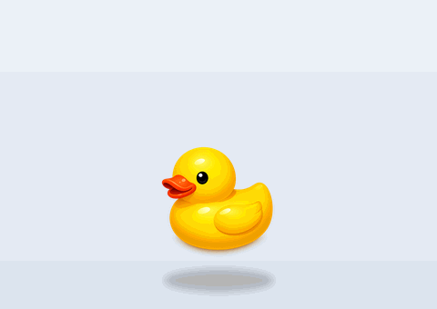
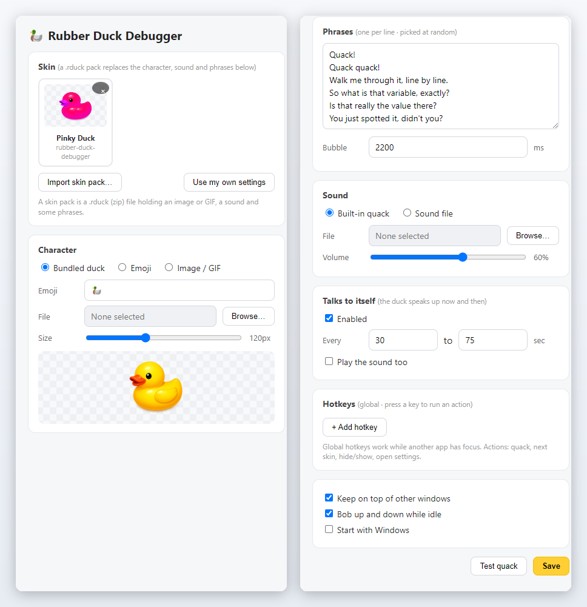
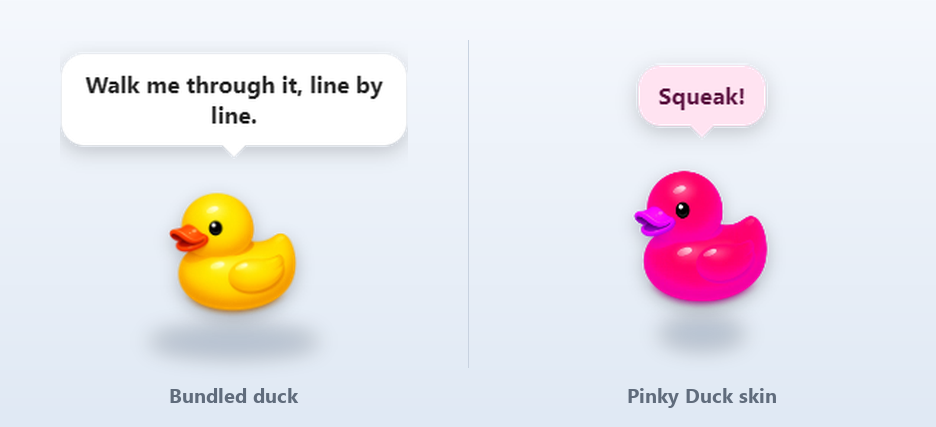

# Rubber Duck Debugger 🦆

<p align="center"><a href="README.md">English</a> | <b>한국어</b></p>

<p align="center">
  
</p>

<p align="center">
  바탕화면에 고무오리를 띄워두고, 클릭하면 꽥 하는 위젯.<br>
  배경 없이 항상 위에 뜨고, 캐릭터·소리·문구는 원하는 걸로 바꿀 수 있다.
</p>

<p align="center">
  <a href="https://github.com/nohseongmin/rubber-duck-debugger/releases/latest"></a>
  
  <a href="LICENSE"></a>
  <a href="https://github.com/nohseongmin/rubber-duck-debugger/stargazers"></a>
</p>

<p align="center">
  <a href="https://github.com/nohseongmin/rubber-duck-debugger/releases/latest/download/RubberDuckDebugger-Setup.exe"><b>⬇️ 윈도우용 설치파일 받기</b></a><br>
  <sub>설치파일 하나. node도 빌드도 필요 없다.</sub>
</p>

러버덕 디버깅은 막힌 코드를 고무오리에게 한 줄씩 소리 내어 설명하다가, 설명하는 도중에 스스로 버그를 찾아버리는 오래된 습관이다. 그 오리다. 무슨 말을 하는지 알아듣지는 못하고, 그냥 앉아서 꽥 한다.

## 어떻게 동작하나

오리는 배경이 투명한 채로 다른 창들 위에 떠 있다. 창 테두리가 없으니 바탕화면에 오리만 놓인 것처럼 보인다. 클릭하면 꽥 소리를 내고 몸이 눌렸다 펴지면서 말풍선으로 한마디 한다. 가만히 두면 위아래로 천천히 떠다니고, 이따금 혼자 말을 걸기도 한다. 혼잣말은 기본적으로 소리가 없어서 말풍선만 뜨고 작업을 방해하지 않는다.

오리를 뺀 나머지 영역은 마우스가 통과한다. 바탕화면 아이콘은 오리가 없는 것처럼 그대로 쓰면 된다.

옮기는 건 일부러 별도 모드로 뺐다. 오리를 우클릭해 `Move`를 켜면 점선 테두리가 생기고, 원하는 자리로 끌어다 놓고 `Done`이나 `Esc`를 누르면 된다. 처음 버전은 마우스가 움직인 거리로 클릭과 드래그를 구분했는데, 그러다 보니 꽥 하려던 클릭이 드래그로 먹히는 일이 잦았다. 둘을 갈라놓으니 해결됐다.

단축키에는 꽥(quack), 다음 스킨, 숨기기/보이기, 설정 열기를 걸 수 있고 다른 창을 쓰는 중에도 작동한다. 기본으로 잡힌 건 하나도 없다. 이미 쓰고 있던 단축키를 앱이 가져가면 안 되니 직접 골라 넣는 방식이다.

> 앱 UI는 영어다. 전 세계 사용자를 기준으로 잡았고, 한국어 UI는 아직 없다.

## 설치

1. **[RubberDuckDebugger-Setup.exe](https://github.com/nohseongmin/rubber-duck-debugger/releases/latest/download/RubberDuckDebugger-Setup.exe)** 를 받아 실행한다.
2. "알 수 없는 게시자"라는 경고가 뜬다. 아직 코드사이닝을 안 해서 그렇다 — **추가 정보 → 실행**을 누르면 된다.
3. 화면 우하단에 오리가 나타난다. 좌클릭하면 꽥. 설정과 종료는 오리 우클릭이나 트레이 아이콘에서.

지금은 윈도우 x64만 지원한다. 새 버전은 [릴리즈](https://github.com/nohseongmin/rubber-duck-debugger/releases)에서 다시 받으면 되고, 자동 업데이트는 아직 없다.

## 설정

<p align="center">
  
</p>

탭 없이 한 창에 다 있다. 캐릭터(기본 오리 / 이모지 / 직접 넣은 이미지·GIF)와 크기를 고르고,
말풍선에 띄울 문구를 한 줄에 하나씩 적으면 그중 하나를 랜덤으로 고른다. 꽥 소리를 내 사운드 파일로
바꾸거나, 혼잣말 빈도를 조절하거나, 둥실거리는 게 거슬리면 끄면 된다. 윈도우 시작할 때 같이
켜지는 옵션도 있다(기본은 꺼짐).

## 스킨팩

<p align="center">
  
</p>

스킨은 캐릭터·소리·문구·말풍선 색을 한 파일로 묶는다. 설정을 여섯 군데 손대는 대신 클릭 한 번으로
전체 모습을 바꾸는 것이다. [`skins/`](skins/)에 든 샘플이 위 사진의 분홍 오리다.

형식은 단순하다. `skin.json`과 거기서 가리키는 파일들을 zip으로 묶고 확장자를 `.rduck`로 바꾸면 된다. 설정 → 스킨에서 가져온다.

```
my-skin.rduck
├─ skin.json
├─ char.webp     # png / gif / apng / webp — 애니메이션도 된다
└─ quack.mp3     # 선택. 없으면 기본 합성 꽥을 쓴다
```

```json
{
  "formatVersion": 1,
  "id": "my-skin",
  "name": "내 스킨",
  "author": "닉네임",
  "version": "1.0.0",
  "character": { "image": "char.webp", "size": 130 },
  "sound":     { "file": "quack.mp3", "volume": 0.6 },
  "phrases":   ["삑!", "그 줄 다시 읽어봐"],
  "bubble":    { "textColor": "#5a1040", "bgColor": "#ffe3f1" }
}
```

필수는 `id`와 `character.image` 둘뿐이다. 나머지를 빼면 앱 기본값을 쓴다.

스킨은 코드가 아니라 애셋이다. 팩 안의 무엇도 실행되지 않는다. 가져올 때 경로 탈출(zip slip), 지나치게 큰 파일과 압축 폭탄, 망가진 매니페스트를 걸러내고 허용된 이미지·오디오만 풀어낸다. 검사 코드는 [`src/skins.js`](src/skins.js)에, 그걸 확인하는 테스트는 [`test/skins.test.js`](test/skins.test.js)에 있다.

## 소스에서 실행하기

```bash
npm install
npm start        # 실행
npm test         # 설정·스킨 임포트 테스트
npm run dist     # dist/ 에 설치파일 빌드
```

Electron 앱이다. 메인 프로세스는 `src/main.js`, 오리 창은 `src/duck/`, 설정 창은 `src/settings/`에 있다. 설정은 `userData/` 아래 JSON 파일로 저장되고 가져온 스킨도 그 옆에 풀린다. 기본 꽥은 오디오 파일 대신 Web Audio API로 만들어 내기 때문에 저장소에 사운드 애셋이 없다.

## 개인정보

네트워크 코드가 아예 없다. 계정도 없고 수집도 없고 어디로 보내는 것도 없다. 렌더러는 `contextIsolation`을 켜고 `nodeIntegration`을 끈 상태로 돌아가며, `src/preload.js`에 적어둔 짧은 목록으로만 메인 프로세스에 닿는다. 원격에서 뭔가 불러오는 건 CSP가 막는다.

## 앞으로

- 오리 여러 마리 동시에 띄우기
- 스팀 출시와 창작마당 연동 — 스킨을 파일로 주고받는 대신 제대로 공유할 수 있게
- 자동 업데이트, 그리고 윈도우가 경고를 그만 띄우도록 서명된 빌드

## 라이선스

MIT. 꽥 소리는 코드로 만들고 오리 그림은 이 프로젝트 것이라, 따로 표기할 서드파티 애셋은 없다. 자세한 건 [CREDITS.md](CREDITS.md).
