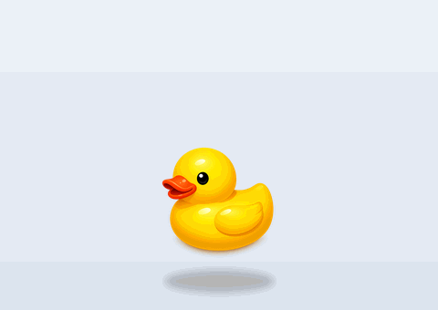
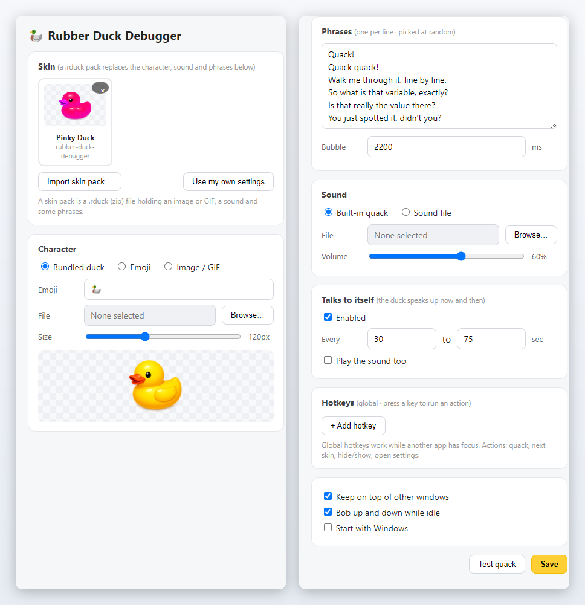
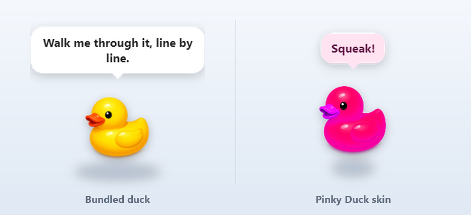

# Rubber Duck Debugger

A small desktop companion for rubber duck debugging. It stays above other windows, quacks when clicked, and displays configurable phrases.



## Installation

Download and run [RubberDuckDebugger-Setup.exe](https://github.com/nohseongmin/rubber-duck-debugger/releases/latest/download/RubberDuckDebugger-Setup.exe). The unsigned Windows x64 installer may trigger an unknown-publisher warning.

The duck starts in the bottom-right corner. Left-click to hear it. Right-click the duck or use its tray icon for settings and exit. Updates are available on [Releases](https://github.com/nohseongmin/rubber-duck-debugger/releases); automatic updates are planned.

## Interaction

The window is transparent, and areas outside the character pass clicks through to the desktop. Clicking plays a sound, animates the character, and selects a phrase.

The duck can bob while idle and show periodic messages. Idle messages are silent by default.

To move it, choose Move from the context menu, drag within the outlined window, then choose Done or press Esc. Keeping movement separate from clicking avoids accidental drags.

Global hotkeys can play the sound, change skins, hide the duck, or open settings. Keys are unassigned until configured.

## Settings



Choose the bundled character, an icon, or an image/GIF, and adjust its size. Enter phrases one per line. Options also include custom sounds, idle-message timing, bobbing, and optional startup with Windows.

## Skin packs



A skin packages the character, sound, phrases, and bubble colors. A sample is included in [skins/](skins/).

A .rduck file is a ZIP archive containing skin.json and the referenced media. Import it through Settings, then Skin.

```text
my-skin.rduck
  skin.json
  char.webp
  quack.mp3
```

Images can be PNG, GIF, APNG, or WebP, including animations. Sound is optional; the app otherwise uses its synthesized quack.

```json
{
  "formatVersion": 1,
  "id": "my-skin",
  "name": "My Skin",
  "author": "you",
  "version": "1.0.0",
  "character": { "image": "char.webp", "size": 130 },
  "sound": { "file": "quack.mp3", "volume": 0.6 },
  "phrases": ["Quack!", "Read that line again"],
  "bubble": { "textColor": "#5a1040", "bgColor": "#ffe3f1" }
}
```

Only id and character.image are required. Omitted fields use defaults.

Packs contain media and JSON, not executable code. Import checks paths, size limits, ZIP bombs, manifests, and allowed extensions. See [src/skins.js](src/skins.js) and [test/skins.test.js](test/skins.test.js).

## Running from source

```bash
npm ci
npm start
npm test
npm run dist
```

The Electron main process is in src/main.js, the character window in src/duck/, and settings in src/settings/. Settings and imported skins live under Electron's userData directory. The default sound is generated through Web Audio.

Pull requests audit dependencies, run tests, and build the Windows installer. To release, update package and lockfile versions together and push the matching vX.Y.Z tag. GitHub Actions publishes the installer and SHA256SUMS.txt after validation.

## Privacy

The app has no network code or account system. Its renderer uses contextIsolation with nodeIntegration disabled. Access to the main process is limited through [src/preload.js](src/preload.js), and its content security policy blocks remote loading.

## Planned work

- Multiple companions.
- A community skin directory.
- Automatic updates and signed builds.

## License

MIT. Artwork belongs to the project and the sound is generated in code. See [CREDITS.md](CREDITS.md).
